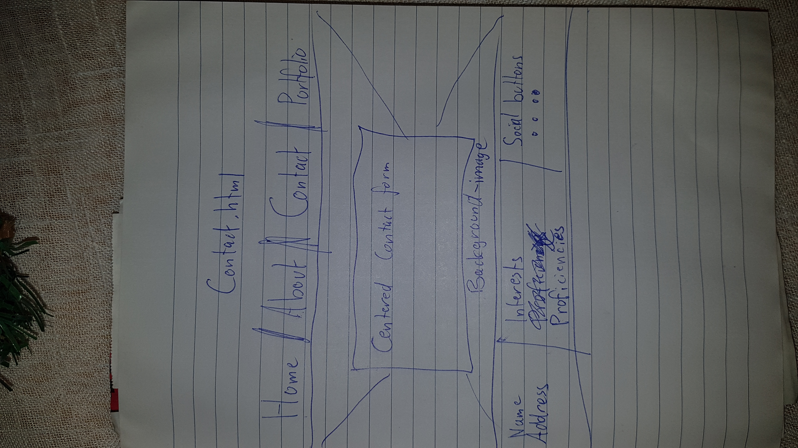

#  My Resume Website

The aim of this website is to present myself to potential employers in the best light and showcase my abilities as a front end developer.
The website itself will be pretty basic at this stage but will provide an easy interface with contextual content for potential employers and assessors to see, 
however on my portfolio page I will showcase more advanced projects later on in the course.

## wireframes

Wireframes are in the assets/wireframes folder.

## Features

* first

* second

* third

## Testing

I have double-checked that all links are working and run all HTML and CSS through the W3C validation service with a good grade.

## Deployment

The project has been deployed to Github Pages - Add link here later 

## Credits

I wish to thank my parents, God and everyone else who supported me on this incredible journey through a lot of sweat, blood and tears